# Clasificador de animales
## Aplicación movil para identificar animales
### Descripción
En el presente repostirorio se muestra el codigo fuente con el que fue creado la aplicación movil, ésta fue hecha en android studio, utilizando kotlin y jetpack compose.

Para revisar las versiones de las librerias y dependencias usadas en la aplicación, ingrese al archivo gradle.gradle.kts al nivel de aplicación.

Con el fin de identificar a los animales correctamente se entrenó un modelo de CNN con pytorch y un aproximado de 20k de imagenes, dichas imágenes se encuentran en: [Zenodo](https://doi.org/10.5281/zenodo.19926200), 
adémas, los animales que se pueden identificar con dicha aplicación son los siguientes:

Orden Strigiformes

*  Aegolius acadicus
*  Asio flammeus
*  Asio otus
*  Asio stygius
*  Athene cunicularia
*  Bubo virginianus
*  Glaucidium gnoma
*  Megascops kennicottii
*  Megascops trichopsis
*  Micrathene whitneyi
*  Psiloscops flammeolus
*  Strix virgata 
*  Strix occidentalis
*  Strix sartorii
*  Tyto furcata
 
Género Crotalus

*  Crotalus aquilus
*  Crotalus atrox
*  Crotalus basiliscus
*  Crotalus lepidus
*  Crotalus molossus
*  Crotalus polystictus
*  Crotalus pricei
*  Crotalus scutulatus
*  Crotalus willardi

Todos estos animales habitan en el estado de Zacatecas, México.

Por otro lado, el modelo puro entrenado se puede descargar en: [Modelo ResNet50](https://drive.google.com/drive/folders/1EVbwNs3NiT5-lU0dxr1VLg_0NcgxXaHS?usp=drive_link), para visualizar los resultados obtenidos por el modelo [vaya a la sección "Resultados del modelo de IA"](#resultados-del-modelo-de-ia)

---

### Diseño de la aplicación

La pantalla principal, en la cual, se podrá tomar cualquier fotografía o cargar alguna imagen desde la misma galería, es la siguiente.

   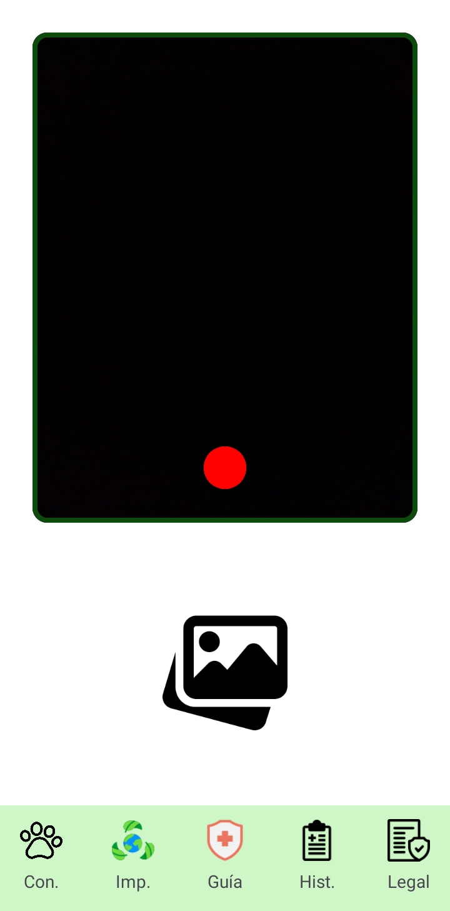

Asimismo, en el menú inferior se encuentran las siguientes cinco pantallas que contienen información importante sobre las especies.

A continuación se muestran las vistas de las pantallas presentes en la aplicación.

<b>Click para ver las pantallas del menú inferior</b>

 

---
  
  Estas dos primeras imágenes muestran pantallas informativas dentro de la aplicación.
  
   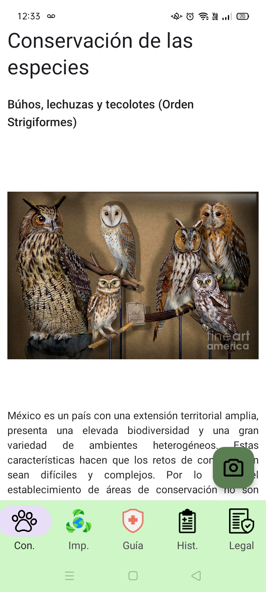
  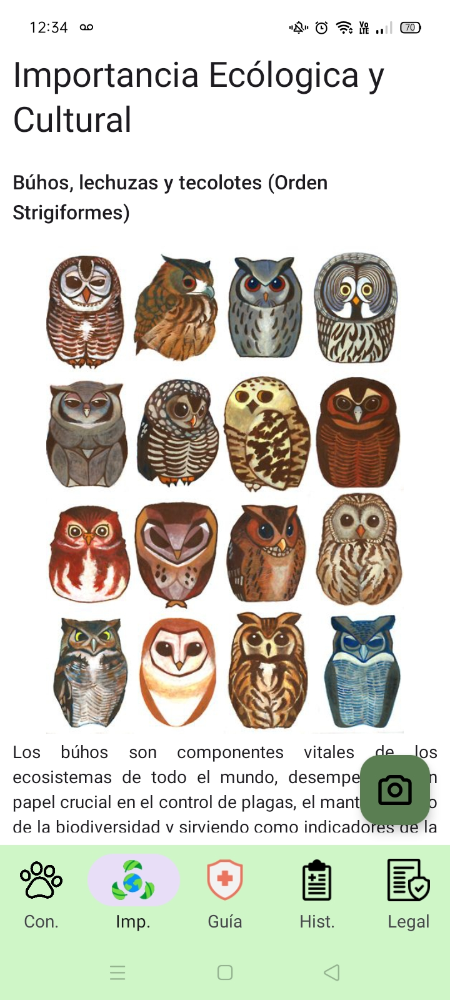

--- 

Enseguida, también se muestra una guía para informar lo que se debe de hacer en caso de un ataque/encuentro con una serpiente de cascabel.

  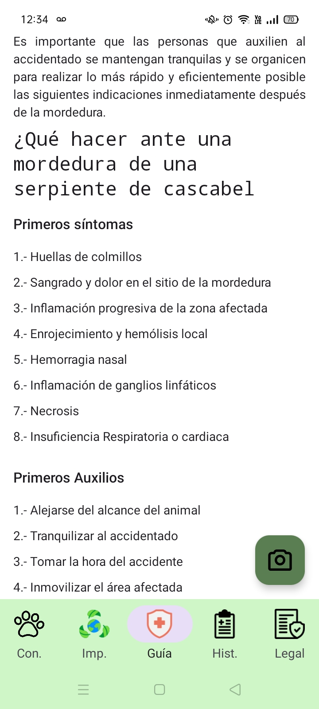
  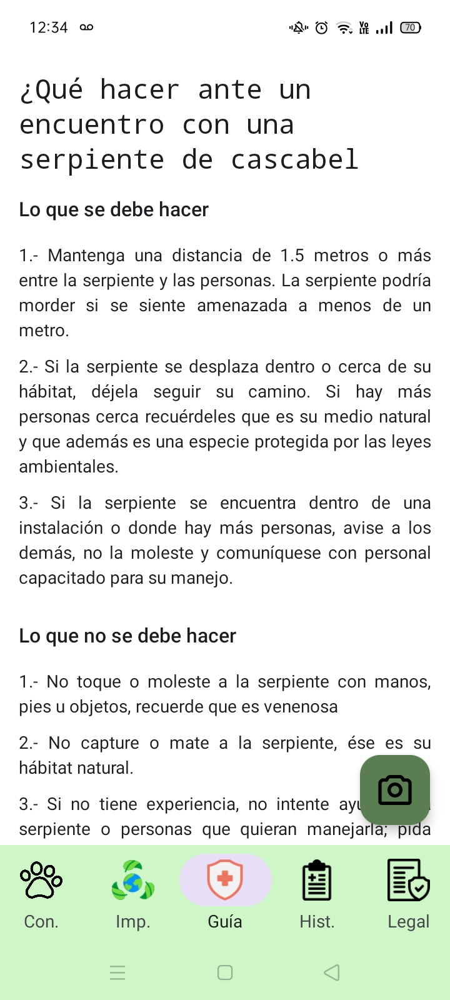

---

  El sistema cuenta con un historial donde se almacena cada observación que el usuario haga y que el animal sea identificado, guardándose en una base de datos local en la aplicación.
  
  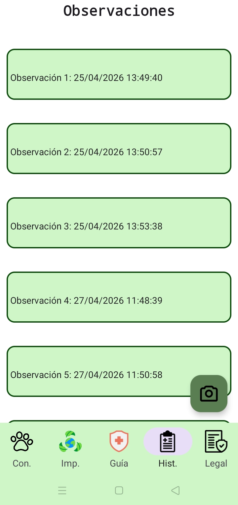

---

  Finalmente, se puede visualizar y leer los términos y condiciones de uso en la aplicación en cualquier momento.
  
  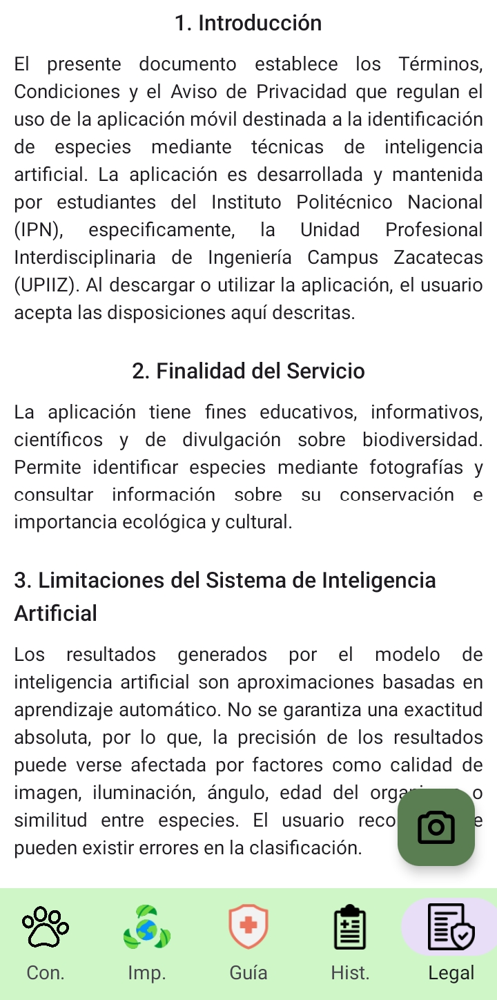

---
 
 

<b>Click para ver las pantallas de los permisos</b>

 

 ---
  
  Para que la aplicación funcione correctamente el usuario debe leer y aceptar los términos y condiciones de uso debido a que la mayoría de las especies que clasifica el sistema se encuentran en peligro de extinción o con protección especial de acuerdo a la NORMA Oficial Mexicana NOM-059-SEMARNAT-2010.
  
  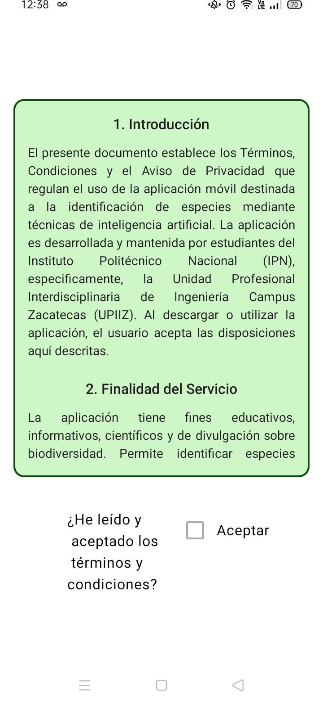

---

  Enseguida se solicita el permiso de la cámara del dispositivo para tomar las fotografías necesarias para la clasificación de los animales.

  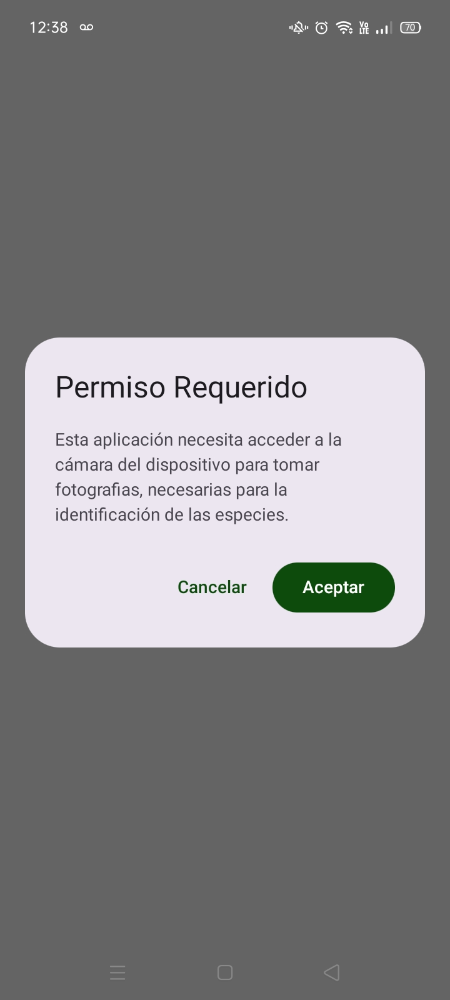

  ---

  Del mismo modo, una vez que algún animal sea clasificado se solicitará el permiso para acceder a la ubicación del dispositivo, el usuario es libre de aceptar o no, en caso de rechazar el permiso la aplicación continuará funcionando correctamente.

  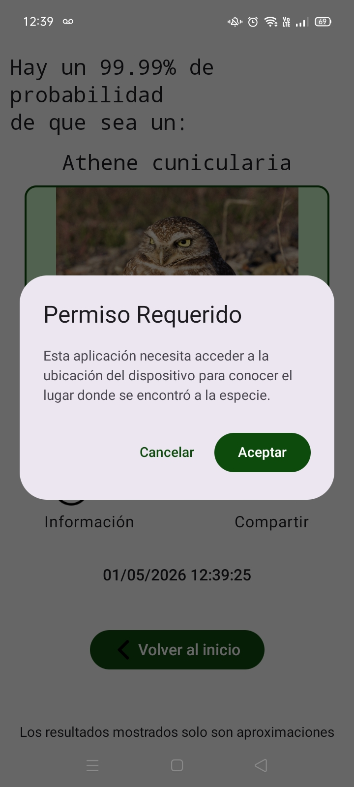

---

 

<b>Click para ver las pantallas del funcionamiento de la aplicación</b>

 

 ---

  Primera pantalla cuando se elige una imagen antes de clasificar.
  
  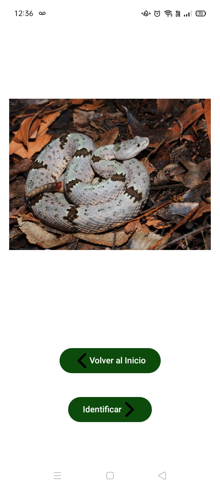

  ---
  
  Pantalla de espera mientras se realiza la clasificación.
  
  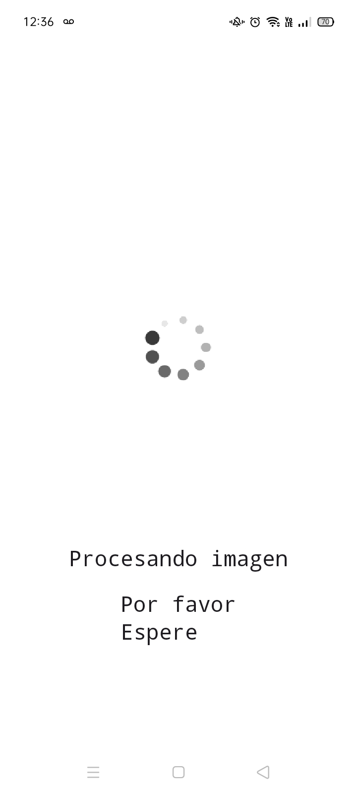

  ---
  
  Se muestra un error en caso de que no se logre clasificar al animal correctamente.
  
  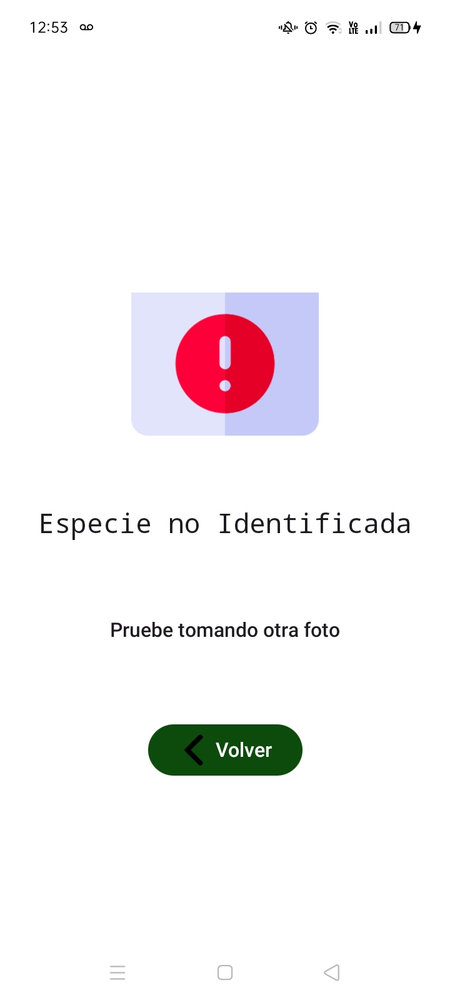

  ---
  
  Los resultados muestran la fecha y hora, además de la ubicación si fue aceptado el permiso.
  
  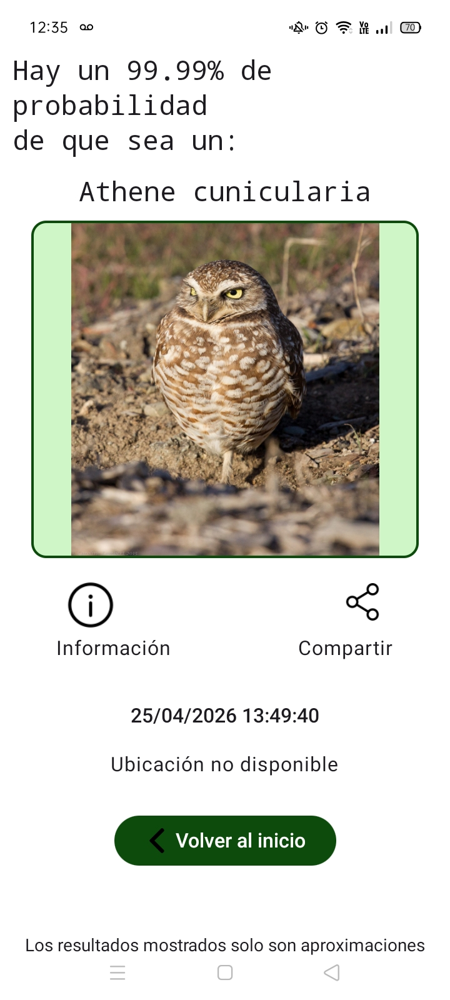

---

  Se podrá visualizar información del animal clasificado si se presiona el icono izquierdo.
  
  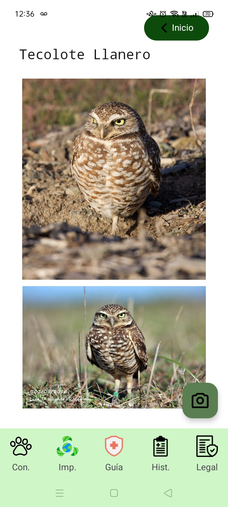

  ---
  
  Igualmente, se podrá compartir la observación realizada en redes sociales mediante el icono derecho.
  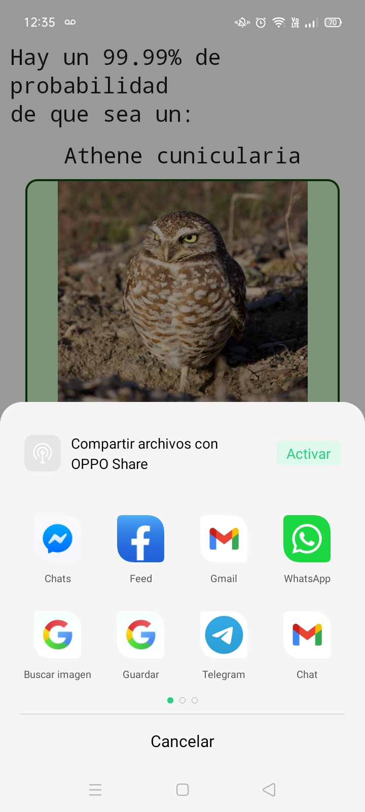

  ---
 

---

### Resultados del modelo de IA

 
Hiperparametros utilizados en tres modelos.

| Modelo | Optimizer | Epochs | Batch size | num workers | Learning rate | 
|--------|-----------|--------|------------|-------------|---------------|
| ResNet-50         | Adam | 20 | 32  | 2 | 0.001 |
| Efficient Net-B0  | Adam | 20 | 512 | 2 | 0.005 |
| Squezze Net-1.0   | Adam | 15 | 32  | 2 | 0.001 |

***

Resultados obtenidos entre el dataset de entrenamiento y el dataset de validación.

| Modelo | Pérdida (Train) | Exactitud (Train) | Pérdida (Val) | Exactitud (Val) | Tiempo promedio por época (Min). |
|--------|-----------------|-------------------|---------------|-----------------|----------------------------------|
| ResNet-50        | 0.3378 | 88.73% | 0.3412 | 88.88% | 5.45 |
| Efficient Net-B0 | 0.3893 | 87.71% | 0.38   | 87.04% | 5.06 |
| Squeeze Net-1.0  | 0.4065 | 86.61% | 0.429  | 86.71% | 5.29 |

***

Enseguida se muestra los resultados y la evolución durante la aplicación de una validación cruzada con diez folds.

 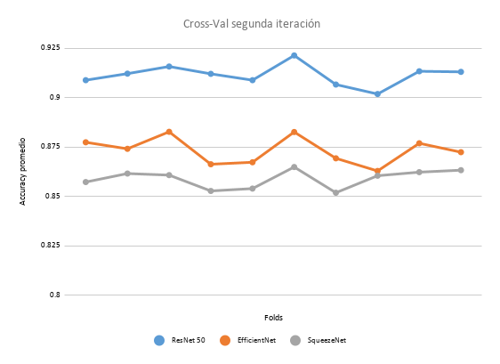

***

Finalmente se calculó las Macro´s necesarias con el que se definió que el mejor modelo entre los tres fue ResNet-50.

| Métrica | ResNet-50 | Efficient Net-B0 | SqueezeNet-1.0 |
|---------|-----------|------------------|----------------|
| Macro puntuación F1 | 91.15% | 87.35% | 85.92% |
| Macro precisión     | 91.19% | 87.39% | 85.98% |
| Macro Sensibilidad  | 91.13% | 87.34% | 85.88% |

